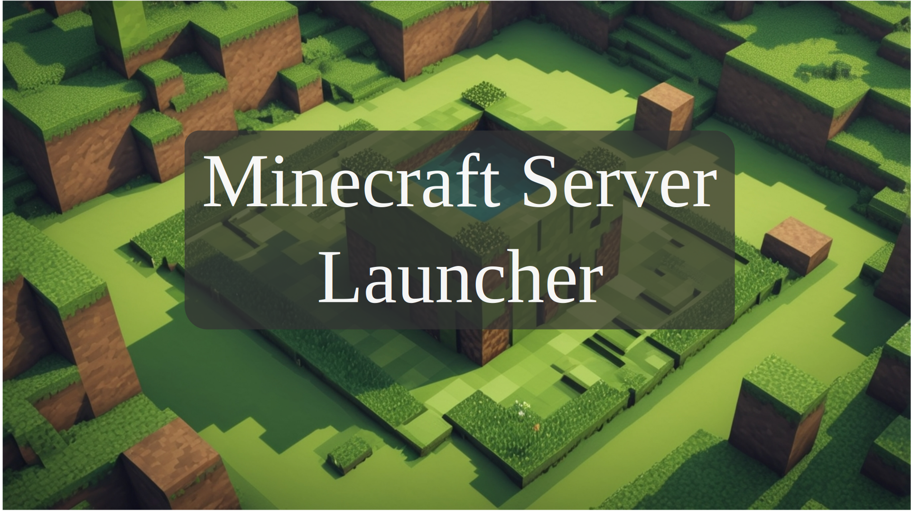

# Minecraft Server Launcher

## Apresentação
 - Seja bem vindo(a) ao Launcher do Minecraft Server, nele você poderá criar servidores para Minecraft Bedrock e Java, e acessá-los com somente uma aplicação. Siga os passos abaixo para a Instalação...

## Dependências
 - Para o servidor java poder ser executado, será necessário instalar uma dependência: "JRE 65.0", para isso deve-se instalá-lo em sites de terceiros, pois no site oficial [Java](java.com) não é disponibilizado, para isso o exemplo que melhor funcionou foi o [Temurin](https://adoptium.net/temurin/releases/), no link "https://adoptium.net/temurin/releases/?os=windows&arch=x64&package=jdk&version=22" procure pelo sistema operacional windows, arquitetura x64,tipo de pacote "JDK", e Versão 22, ou mais recente! logo em seguida procure pelo instalador ".msi", baixe e instale na sua máquina, só assim o servidor java vai funcionar!!
 __ATENÇÃO: SOMENTE PARA WINDOWS 10 OU SUPERIOR__

## Instalação
 - antes de qualquer coisa, execute o LaunchServer, espere carregar os arquivos principais, pressione enter, e no menu iniciar, entre em Minecraft Java, e siga os passos, assim que terminar de extrair os arquivos você deve acessar a pasta [Java](Java) e abrir o arquivo [eula](Java\eula.txt)
 - Para executar algumas funções básicas do servidor é preciso que um arquivo eula.txt seja aceito 
    
    ```
    eula=true
    ```
 - execute o servidor novamente, entre em Minecraft Java, no menu principal, e aproveite o jogo (nota se preferir você pode mudar a alocação de memória utilizada pelo seu computador durante o funcionamento do servidor, ou se irá apareceu uma UI do minecraft java, ou até mudar o tema do Server Launcher, só explorar as configurações do Launcher de Minecraft Server!).
 - instalado! agora para conectar no seu Minecraft Java, é só ir entrar no minecraft, ir em Multijogador, Adicionar um novo servidor, e como ip é só colocar o seguinte:
    ```
    localhost
    ```